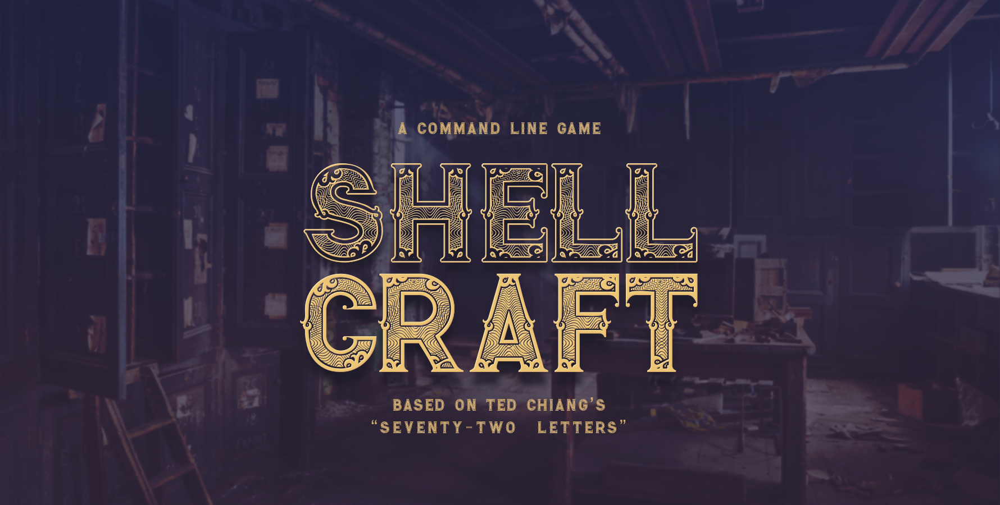

# Welcome to ShellCraft



ShellCraft is a hackable game about mining, crafting, and puzzling, loosely based on Ted Chiang's short story ["Seventy-Two Letters"](72letters)

!!! warning "Under development"
Shellcraft is under development and at this time does not provide a complete game experience.
You're welcome to download the game and play for as long as the content lasts, though.

To download and play the game right now, simply run:

```sh
# Install ShellCraft
$ pipx install shellcraft

# Run ShellCraft:
$ shellcraft
```
