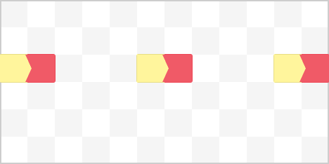
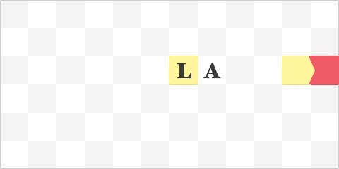
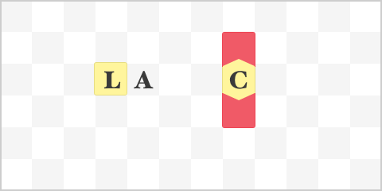

# Nomenclature

## Names

Without Names, automata would just be lifeless blocks of clay and metal. By inserting a Name into an automaton, you can make it come to life and work for you.

Each Name consists of up two seventy-two letters, arranged in six rows of twelve. To the uneducated reader, these letters may seem utterly random. But through advancements in nomenclature, the science of creating Names, scholars have discovered that Names are made from Epithets, each designating a specific trait or capability.

When written correctly, a name describes the very essence of the object imbued with it. According to *A Boy’s Guide to Nomenclature*, current thinking holds that there is a lexical universe as well as a physical one, and bringing an object together with a compatible name causes the latent potentialities of both to be realized. There is no single "true name" for a given object: depending on its precise shape, a body might be compatible with several names, known as its "euonyms," and conversely a simple name might tolerate significant variations in body shape.

### Lexical Charges

The current understanding of the lexical realm has it that when a Name is inserted into an automaton, it operates by traversing lexical charges across the name. There are two types of charges: *weak* charges and *strong* charges.

Weak lexical charges on their will immediately disperse. Strong lexical charges however can sustain themselves indefinitely - if a letter becomes strongly charged, it will usually remain so until the charge is removed by Traversion.

### Traversion

Traversion of charges occurse when a weakly charged letter neighbours a strongly charged one. The weakly charged letter will disperse it's charge and become uncharged as usual. However the strong charge will ignite the neighbouring letter -- in the direction opposite of the weak charge -- to become strongly charged, and partially discharge itself, becoming weakly charged.

In effect, that means that a weak charge neighbouring a strong charge will "travel" across the name:

Note that charges that reach the boundaries of the name will actually disperse.

## Epithets

Epithets are the basic components that Names are made of. Through your pursuit of nomenclature, you will learn to combine these Epithets to make proper Eyonyms for your automata.

### Life

The *Life* epithet, designated by the letter *L*, is the simplest and most vital one. When placed in a name, it periodically creates a weak charge:

Since weak charges can't sustain themselves, the Life epithet is usually accompanied by an *Amplification* epithet:

### Amplification

The *Amplification* epithet, designated by the letter *A*, is a basic transducer. When one of its neighbouring epithets exhibit a weak charge, the *Amplification* epithet will immediately get strongly charged, effectively allowing the charge to travel across the name:

### Movement

The *Movement* epithet, designated by the letter *M*, might be the most studied epithets of all time. It is incredibly versatile in that it works on most bodies that possess some form of limb, even snake-like crawlers. It has to be placed in the area of the name corresponding to the limb for the body to accept the name. When activated with a strong lexical charge, the *Movement* epithet will consume the charge and move the automaton forward. As such, it belongs to the class of Non-Traversing Epithets.

### Concurrence

The *Concurrence* epithet, designated by the letter *C*, imbues the automaton with the possibility of simultaneous actions. When strongly charged, it will create two strong charges perpendicular to the direction the charge was travelling from.

### Silence

The *Silence* epithet, designated by a *S*, is non-traversing and can never be charged. Any strong charge traversing into a Silence epithet will immediately disperse.

### Restraint

The *Restraint* epithet, designated by a *R*, will only traverse every second time it gets strongly charged. Every other time, it will disperse che charge.
